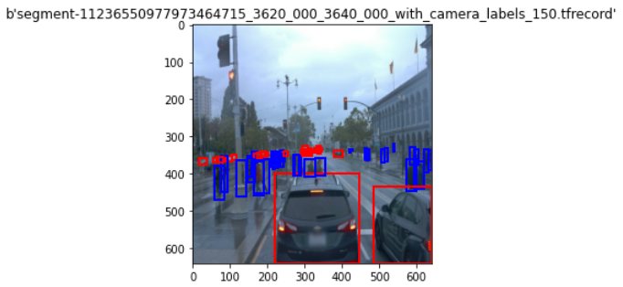
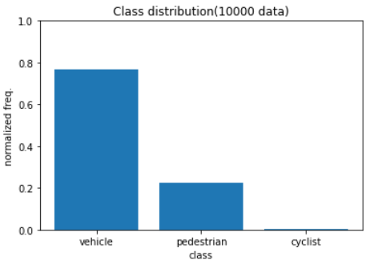
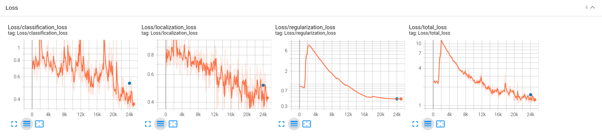
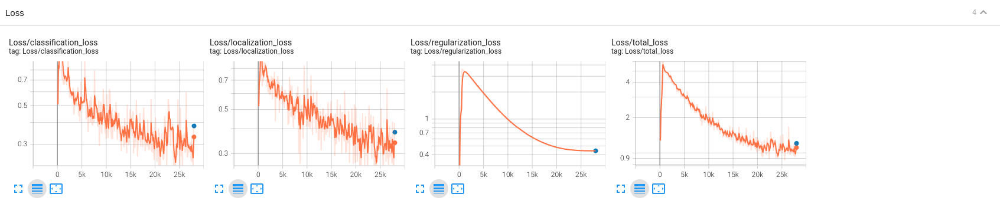

# Object Detection in an Urban Environment

## I. Project Overview

In this project, the below items are covered.

- Download dataset using the provided script([download_process.py](./download_process.py))
- Implement a script([create_split.py](./create_split.py)) splitting the downloaded dataset into three sets(train, validation, and test)
- Implement a script([Exploratory Data Analysis.ipynb](https://github.com/aram-father/SDC-Project-1/blob/main/Exploratory%20Data%20Analysis.ipynb)) analyzing the downloaded dataset
- Train/Evaluate the reference model using the provided scripts
- Improve the reference model by changing the training configurations
- Generate a video showing the working of the improved model

## II. CAUTION !!!

I've not modified the provieded [Dockerfile](./build/Dockerfile). However, it seems that the [ToT Dockerfile](https://github.com/udacity/nd013-c1-vision-starter/blob/main/build/Dockerfile) is not working properly(raising a lot of exceptions). So, after building the docker image, I've modified the below manually:

- Replace keras package: [link](https://knowledge.udacity.com/questions/878146)
    - The dataset download script didn't work without this modification
- Replace function base script: [link](https://knowledge.udacity.com/questions/810743)
    - The evaluation script didn't work without this modification

## III. Setup

### III.1. Clone repository

```bash
mkdir {PRJ_TOP_DIR}
cd {PRJ_TOP_DIR}
git clone https://github.com/aram-father/SDC-Project-1.git
```

### III.2. Build docker image & Start container

```bash
cd {PRJ_TOP_DIR}/SDC-Project-1/build
docker build -t project-dev -f Dockerfile .
docker run --gpus all -v {PRJ_TOP_DIR}/SDC-Project-1/:/app/project/ --network=host -ti project-dev bash
```

### III.3. Download dataset

```bash
cd {PRJ_TOP_DIR}/SDC-Project-1
mkdir ./data
python download_process.py --data_dir ./data
```

## Dataset

[Exploratory Data Analysis.ipynb](https://github.com/aram-father/SDC-Project-1/blob/main/Exploratory%20Data%20Analysis.ipynb) explores the downloaded dataset. As the below figure shows, the dataset has a lot of images containing vehicle, pedestrian, and cyclist labels.



Furthermore, I've sub-sampled the images from the dataset and visualized the label distribution as below. I could see that there is a relatively smaller number of labels for cyclists than vehicles and pedestrians.



## Cross validation

[create_split.py](./create_splits.py) splits the downloaded dataset(III.3) into the below three sets.

- train: 80% of the dataset
- val(idataion): 10% of the dataset
- test: 10% of the dataset

## Reference experiment



I could see that the loss didn't reach to the plateau. So, it might be possible to improve the model by increasing the training epoch.

## Improve on the reference

My finding from the result of the reference model was that the loss didn't reach to plateau. So, I've increased the trainig epoch.

I found that there is an augmentation called `ssd_random_crop` which is recommended for the ssd resnet. So, I've used it.

Lastly, I found that a alot of images are dark and the labels are occuluded frequently. So, I've added the below data augmentations.

- `random_rgb_to_gray`
- `random_adjust_brightness`
- `random_black_patches`

The resulting pipeline config file is [./experiments/experiment2/pipeline_new.config](./experiments/experiment2/pipeline_new.config).

The below figure shows the result of the implroved model.



|                       | reference_model   | improved_model | improvement(%) |
|:---------------------:|:-----------------:|:--------------:|:--------------:|
| classification_loss	| 0.535	            | 0.382	         | -28.614        |
| localization_loss	    | 0.514	            | 0.384	         | -25.229        |
| regularization_loss   | 0.452	            | 0.442	         | -2.211         |
| total_loss            | 1.501	            | 1.208	         | -19.520        |

## Model export

I've exported the improved model at [./experiments/experiment2/exported/saved_model](./experiments/experiment2/exported/saved_model/)

## Inference video

Here is the resulting inference video.

